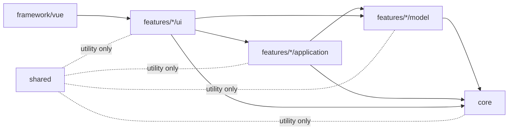

# Directory Structure Guidelines (gent-gui)

This document defines a practical, incremental directory structure for `packages/gent-gui`.

The goal is to keep today’s codebase simple while making framework migration (for example, Vue to React) and package-level reuse easier as the project grows.

## Design Goals

- Keep the current small codebase easy to understand.
- Reduce framework lock-in by separating framework-agnostic logic from framework adapters.
- Prepare for reuse across `packages/*` without over-engineering early.
- Use an incremental approach: start simple, split only when code volume and ownership justify it.

## Core Principles

1. **Core first, framework second**
   - Business/domain logic should not depend on Vue (or React).
   - UI framework-specific code should be an adapter layer.
2. **Feature-oriented grouping at app level**
   - Group files by feature/use-case, not only by technical type.
3. **Progressive extraction**
   - Keep logic in `gent-gui` first.
   - Extract to a new package only when reused by multiple apps or runtimes.
4. **Small-team friendly**
   - Avoid deep nesting and too many tiny directories in the early phase.

## Recommended `gent-gui/src` Layout (Current to Near Future)

```text
src/
  app/                      # app bootstrap, global providers, routing (if needed)
  core/                     # framework-agnostic logic (types, schema utils, validation helpers)
    profile/
    schema/
    validation/
  features/                 # user-facing feature units
    generation-profile/
      model/                # feature-specific domain model (framework-agnostic)
      application/          # feature use-cases / orchestration
      ui/                   # framework-neutral UI contracts (optional at this stage)
  framework/                # framework adapter implementations
    vue/
      entry/                # main.ts, root app wiring
      components/
      jsonforms/
      composables/
  shared/                   # cross-feature utilities used only inside gent-gui
    ui/
      vue/
        primitives/         # reusable primitive UI components (Button, Checkbox, etc.)
    utils/
    constants/
    types/
  assets/
  styles/
```

## Minimal First Step (Do Not Over-Split Yet)

Given the current code size, start with the minimum structure below and evolve later:

```text
src/
  app/
  core/
  features/
  framework/vue/
  shared/
```

You can move existing files gradually:

- `main.ts` -> `framework/vue/entry/main.ts`
- `App.vue` -> `framework/vue/components/App.vue` (or feature-level Vue component)
- `schema/initialGenerationProfile.ts` -> `core/profile/initialGenerationProfile.ts`

## Second Step (Applied)

The current codebase now applies a feature split for the generation profile editor:

```text
src/
  core/
    profile/
      initialGenerationProfile.ts
    schema/
      generationProfileSchema.ts
  features/
    generation-profile/
      model/
      application/
      ui/vue/
  framework/
    vue/
      entry/main.ts
      components/App.vue
```

`framework/vue/components/App.vue` is now a thin root wrapper, and the generation profile flow is owned by `features/generation-profile`.

## `features/*/ui/vue` vs `framework/vue`

Use this rule of thumb during development:

- Put files in `features/*/ui/vue` when they represent a **feature screen or feature-local UI parts**.
- Put files in `framework/vue` when they represent **app bootstrap or framework adapter wiring**.

### Current examples

- `src/features/generation-profile/ui/vue/GenerationProfileEditorPage.vue`
  - Feature page for generation profile editing.
- `src/features/vue-playground/ui/vue/VuePlaygroundPage.vue`
  - Feature page and feature-local learning UI.
- `src/framework/vue/components/App.vue`
  - Thin root shell that selects which feature page to render.
- `src/framework/vue/entry/main.ts`
  - Vue bootstrap (`createApp`, global style import, mount).

### Quick decision checklist

- If the file would still exist after replacing Vue with another framework, place logic in `core` / `features/*/(model|application)` and keep only adapter code in `ui/vue`.
- If the file is about `createApp`, root mounting, or global framework integration, place it in `framework/vue`.
- If the file is tied to one use case (profile editor, playground, etc.), place it in that feature's `ui/vue`.

## Primitive UI Components (Button / Checkbox)

For reusable primitive Vue UI components (for example `Button`, `Checkbox`), use:

- `src/shared/ui/vue/primitives/*`

Placement rule:

- `features/*/ui/vue`: feature-local UI for a specific use case.
- `framework/vue`: app bootstrap and framework adapter wiring.
- `shared/ui/vue/primitives`: reusable, presentational building blocks shared across features.

Examples:

- `src/shared/ui/vue/primitives/BaseButton.vue`
- `src/shared/ui/vue/primitives/BaseCheckbox.vue`

Primitive components should stay UI-focused and avoid feature/business logic.

## Package-Level Extraction Rules (`packages/*`)

When code is reused beyond `gent-gui`, extract it into a package under `packages/`.

### Candidate package split

- `packages/gent-ui-core`
  - Framework-agnostic profile/domain/schema helpers.
- `packages/gent-ui-vue`
  - Vue-specific components/adapters for `gent-ui-core`.
- `packages/gent-ui-react` (future)
  - React-specific components/adapters for `gent-ui-core`.

### Extraction criteria

Extract only when at least one is true:

- Same logic is required in 2+ packages/apps.
- Framework migration work is blocked by mixed dependencies.
- Independent versioning/release cadence is needed.
- Test scope and ownership become difficult inside one package.

## Dependency Direction Rules

Keep dependencies one-way:

- `core` -> no dependency on `framework/*`
- `features/*/model|application` -> may depend on `core`, never directly on framework runtime APIs
- `features/*/ui/*` -> may depend on `core` and `features/*/(model|application)`, never on `framework/*`
- `shared/ui/vue/primitives/*` -> should be framework-level UI primitives without feature-specific dependencies
- `framework/vue/*` -> should depend on `features/*/ui/vue/*` only
- `shared` -> utility-only, no feature-specific business rules

This keeps migration costs bounded and avoids cyclic dependencies.

These boundaries are enforced in ESLint (`no-restricted-imports`) for:

- `core` and `features/*/(model|application)` (cannot depend on `framework` or `ui`),
- `framework/vue` (cannot depend on `core` or `features/*/(model|application)`),
- `features/*/ui` (cannot depend on `framework`),
- `shared/ui/vue/primitives` (cannot depend on `core`, `features`, or `framework`).

## Dependency Diagram



## Naming and Placement Conventions

- Prefer explicit names: `buildProfileJson.ts`, `validateGenerationProfile.ts`, `profileMapper.ts`.
- Keep `index.ts` barrel files optional; add only when imports become noisy.
- Co-locate tests with source when practical (`*.test.ts`) or place under `test/` for integration-heavy tests.
- Avoid creating directories with only one file unless growth is expected soon.

## Best-Practice Notes Applied Here

- Layered architecture (domain/core separated from UI adapters).
- Feature-first structure for UI apps (improves navigability at scale).
- Monorepo package extraction only at clear reuse boundaries.
- Incremental architecture change rather than up-front full modularization.

## Review Checklist (for future PRs)

- Does new logic belong to `core` instead of `framework/vue`?
- Is any framework API leaking into non-framework layers?
- Should this code remain in `gent-gui`, or is it shared enough for a new package?
- Is the directory split justified by current complexity?
- Are tests placed near the responsibility they validate?
